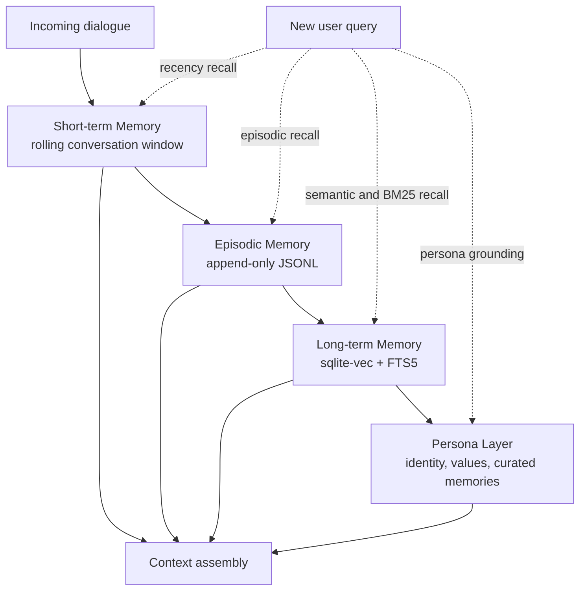
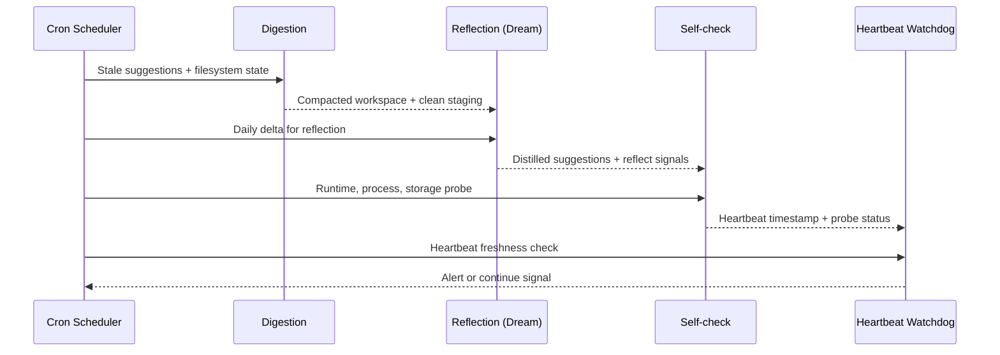

# Personal LLM Agent

> A self-hosted, always-on LLM agent with long-term memory, tool use, and autonomous nightly reflection. Built on FastAPI, DeepSeek, Claude, and sqlite-vec. Runs on a single 2GB VPS.

## Overview

This project explores what happens when you treat an LLM agent as a **long-running process** with its own filesystem, its own memory, and its own circadian rhythm — rather than as a stateless API call.

- **Physical footprint**: 1 uvicorn process + scheduled cron jobs on a 2GB VPS
- **Interaction**: Messaging app webhook (single user, single tenant)
- **Persistence**: Flat files + sqlite-vec + FTS5 (no containers, no ORM)
- **Runtime cost**: ~$2K/month LLM API budget (DeepSeek primary, Claude for heavy tasks)

## Architecture

### Four-Layer Memory

1. **STM (Short-term)** — rolling conversation window, auto-compressed above a configurable turn threshold
2. **Episodic** — append-only JSONL, all conversations persisted with restrictive file permissions
3. **LTM (Long-term)** — `sqlite-vec` (1024-dim vectors) + FTS5 (BM25) + audit log
4. **Persona** — a small set of Markdown files defining identity, values, and curated memories

### Memory Flow

### Three-Way Hybrid Retrieval

Every user query triggers three parallel recall paths:

- **Vector recall** via `bge-m3` embeddings (cosine KNN)
- **FTS5 full-text recall** with BM25 ranking and input sanitization
- **Recency recall** from the most recent episodes

Results are merged by `memory_id` and scored by a weighted fusion of similarity, importance, recency, and cross-path agreement. Per-source quotas prevent any single retrieval path from dominating the final context.

Relevance filtering is delegated to an LLM guardrail rather than a fixed similarity threshold — a deliberate architectural choice after observing threshold drift on small corpora.

### Autonomous Nightly Cycle

Once per local night, the agent runs a scheduled pipeline covering three phases:

- **Pre-reflection** — stale suggestion cleanup; filesystem digestion (a "10-organ" housekeeping pattern that compacts staging state before the heavy LLM phase begins)
- **Reflection** — multi-stage LLM distillation of the day's conversational delta, with bounded retries and offsite backup of the final artifact
- **Post-reflection** — a multi-item self-check health probe, a morning report to the user, and a heartbeat watchdog that fires only on staleness

Each stage has a circuit breaker that yields to the next if it overruns, ensuring the daily cycle always completes before the user wakes up.

### Nightly Cycle Sequence

### Safety Layers

**Tool-call sandbox (`safe_bash`)** — a multi-layer defense wrapper around shell execution, covering:

1. Input sanitization (metacharacters, recursive flags)
2. Command allowlisting at the binary level
3. Path and device-file denial
4. Hard limits on length, runtime, and output size
5. Environment isolation

All rules are tuned for a single-user conversational agent and are not intended as a general-purpose sandbox.

**Identity lock** — A small set of persona files defining identity, values, and curated memories are protected by process-level constants, filesystem-level read-only permissions, and a git pre-commit hook. The reflection process is restricted to writing only into a designated suggestions queue, never the persona itself.

**Conversation lock** — per-sender file lock with a circuit breaker; prevents context cross-contamination from concurrent messages.

**Message idempotency** — sliding-window deduplication keyed by message id, protects against webhook retries.

## Key Engineering Decisions

- **Flat files over databases** for persona — human-readable, git-friendly, diff-able, reviewable
- **Append-only memory with bounded audit rollback** — no destructive writes on long-term store
- **LLM guardrail > similarity threshold** — thresholds drift; guardrails scale
- **Separate cron ownership domains** — filesystem ownership isolation prevents privilege cascading between scheduled jobs

## Reliability Patterns

- **Deadman switch** — self-check writes a heartbeat; a separate cron validates staleness rather than success
- **Hardened reflection pipeline** — webhook heartbeat touch, reflect-signal injection, null-guard cursor, poison-batch DLQ
- **Null guard** — prevents cursor over-advance when the LLM returns a degenerate output (e.g. "nothing to distill")
- **Message degradation chain** — Markdown card → plain card → chunked text → plain text (a message is never silently dropped)

## Known Limitations

Documented openly in a `REALITY_PATCH` file committed to the repo — a deliberate design to prevent the agent from developing inaccurate self-models:

- The routing brain is **flat fallback**, not a multi-tier architecture
- The self-evolution module is a **stub**, not a live feature
- Only the components listed above are in production; roadmap modules are in sandbox only

Honesty over marketing — especially when the product is an agent that reads its own documentation.

## Status

Single-tenant, personal use. Stable operation ≥ 11 days, MTBF ≥ 72h, p99 response < 8s.

Not open-sourced. This README is for portfolio reference.

## License

Copyright (c) 2026 FAM0508. All rights reserved.

This repository is published for **portfolio demonstration purposes only**.
No part of this work — including its architecture, algorithms, prompt patterns,
or derived concepts — may be reproduced, redistributed, used commercially,
or used to train machine learning models without explicit written permission
from the author.

---

Built with DeepSeek, Claude, sqlite-vec, FTS5, FastAPI, systemd, cron, Git.
